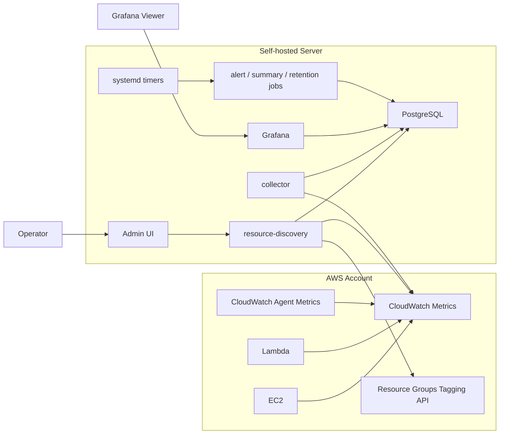
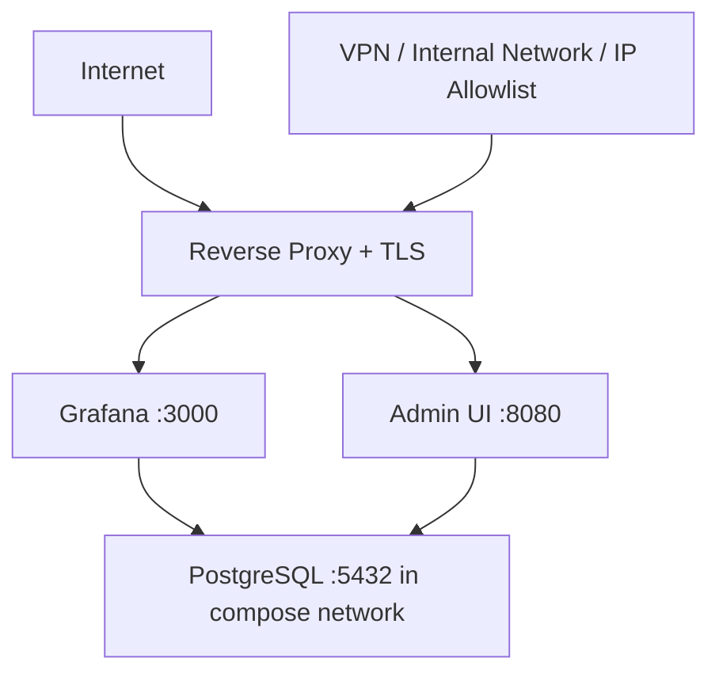

# Architecture

Cloud Monitor는 CloudWatch API 호출 경로와 dashboard 조회 경로를 분리합니다.

Grafana는 PostgreSQL만 조회합니다. CloudWatch API 호출은 resource discovery와 collector가 담당합니다.

## 전체 구조



## 데이터 흐름

### 1. Resource discovery

Admin UI에서 `Discovery 실행`을 누르면 `resource-discovery` binary가 실행됩니다.

Discovery는 AWS shared profile을 사용해 아래 API를 조회합니다.

- CloudWatch `ListMetrics`
- Resource Groups Tagging API

결과는 PostgreSQL에 저장됩니다.

- `resources`
- `discovered_metrics`

Discovery는 metric 후보를 찾는 작업입니다. 실제 collector 수집 대상은 아직 아닙니다.

### 2. Metric definition 생성

운영자는 Admin UI에서 발견된 resource에 추천 metric set을 적용합니다.

추천 metric set:

- `ec2-default`
- `lambda-default`

추천 적용 결과는 PostgreSQL의 `metric_definitions`에 저장됩니다.

Collector의 실제 수집 기준:

```sql
metric_definitions.enabled = true
and metric_definitions.region = AWS_REGION
```

### 3. Metric collection

Collector는 주기적으로 PostgreSQL에서 enabled metric definition을 읽습니다.

그 뒤 CloudWatch `GetMetricData`로 최근 window를 조회하고, 결과를 `metric_points`에 저장합니다.

중복 timestamp는 DB unique constraint로 방지합니다. CloudWatch metric 지연을 고려해 최근 10~15분 window를 반복 조회할 수 있습니다.

### 4. Dashboard query

Grafana는 PostgreSQL datasource만 사용합니다.

Dashboard 조회는 CloudWatch API를 호출하지 않습니다. Dashboard refresh가 늘어나도 CloudWatch API 호출량은 collector interval과 enabled metric definition 수에 의해 결정됩니다.

## Container 구성

| Container | 유형 | 설명 |
| --- | --- | --- |
| `postgres` | long-running | metric, resource, alert, summary 저장소 |
| `grafana` | long-running | dashboard UI |
| `admin-ui` | long-running | 운영자 전용 관리 UI |
| `collector` | long-running | CloudWatch metric 수집 daemon |
| `schema` | one-shot | migration 적용 |
| `metricdefs-sync` | one-shot | example metric definition dry-run 또는 sync |
| `resource-discovery` | one-shot | CloudWatch metric 후보 discovery |
| `alert-runner` | one-shot | alert rule 평가 |
| `summary-rollup` | one-shot | hourly/daily summary 생성 |
| `retention-job` | one-shot | raw metric retention 적용 |

## PostgreSQL schema

주요 table:

| Table | 역할 |
| --- | --- |
| `resources` | discovery된 AWS resource |
| `discovered_metrics` | resource별 CloudWatch metric 후보 |
| `metric_definitions` | collector가 실제 수집할 metric 정의 |
| `metric_points` | CloudWatch에서 수집한 raw metric point |
| `alert_rules` | alert 조건 |
| `alert_events` | alert 발생 이력 |
| `metric_hourly_summary` | hourly aggregation |
| `metric_daily_summary` | daily aggregation |

## AWS credential model

운영 기준은 shared profile입니다.

Host path:

```text
/etc/cloud-monitor/aws/config
/etc/cloud-monitor/aws/credentials
```

Container mount:

```text
/etc/cloud-monitor/aws:/aws:ro
```

Container environment:

```text
AWS_PROFILE=grafana
AWS_CONFIG_FILE=/aws/config
AWS_SHARED_CREDENTIALS_FILE=/aws/credentials
AWS_SDK_LOAD_CONFIG=1
```

Direct AWS key environment variables는 사용하지 않습니다.

## Network boundary



운영 노출 기준:

- Grafana는 HTTPS reverse proxy 뒤에 둡니다.
- Grafana Public Dashboard는 read-only로 제한합니다.
- Grafana Public Dashboard는 `public_grafana_metric_points`, `public_grafana_metric_summary` 같은 public-safe view만 조회합니다.
- Grafana Public Dashboard 공유 링크는 운영 환경에서 생성하고, URL이나 token 값은 repository에 기록하지 않습니다.
- Admin UI는 VPN, 내부망, 또는 IP allowlist 뒤에 둡니다.
- Admin UI는 public unauthenticated service로 노출하지 않습니다.
- PostgreSQL은 public internet에 노출하지 않습니다.

## Scheduling

Collector는 Docker Compose daemon으로 실행됩니다.

```bash
docker compose --profile collector up -d collector
```

One-shot jobs는 systemd timer가 Docker Compose run을 호출합니다.

| Timer | 기본 주기 | Service |
| --- | --- | --- |
| `cloud-monitor-alert.timer` | 1분 | `alert-runner` |
| `cloud-monitor-summary.timer` | hourly | `summary-rollup` |
| `cloud-monitor-retention.timer` | daily | `retention-job` |

Summary rollup은 retention보다 먼저 실행되어야 합니다.

## Backup and restore boundary

PostgreSQL volume은 운영 데이터의 source of truth입니다.

Backup:

```bash
BACKUP_DIR=/srv/cloud-monitor/backups DATABASE_URL="$DATABASE_URL" \
  sh scripts/backup-postgres.sh
```

Backup 파일은 repository에 두지 않습니다. Restore 검증은 disposable DB에서 먼저 수행합니다.

## Security guardrails

- AWS write permission을 추가하지 않습니다.
- Grafana CloudWatch datasource를 추가하지 않습니다.
- CloudWatch Logs collection을 추가하지 않습니다.
- Admin UI를 public unauthenticated service로 노출하지 않습니다.
- `.env`, AWS credential, Slack webhook, AWS account id, full ARN, resource id를 commit하지 않습니다.
- Grafana dashboard provider는 read-only 기준을 유지합니다.

## Failure modes

### AWS profile mount failure

증상:

```text
failed to get shared config profile, grafana
no EC2 IMDS role found
```

의미:

container가 `/aws/config` 또는 `/aws/credentials`를 읽지 못하고 AWS SDK credential chain이 IMDS fallback까지 내려간 상태입니다.

확인:

```bash
docker compose exec admin-ui sh -lc 'env | grep "^AWS_"; ls -l /aws'
```

### Discovery success but empty screen

Discovery endpoint가 성공해도 Admin UI table이 자동 갱신되지 않을 수 있습니다. `조회`를 누르거나 새로고침합니다.

### Collector running but no data

Collector가 실행 중이어도 `metric_definitions.enabled = true` 항목이 없으면 수집할 대상이 없습니다. Admin UI에서 추천 metric set을 적용한 뒤 one-shot collector로 검증합니다.
